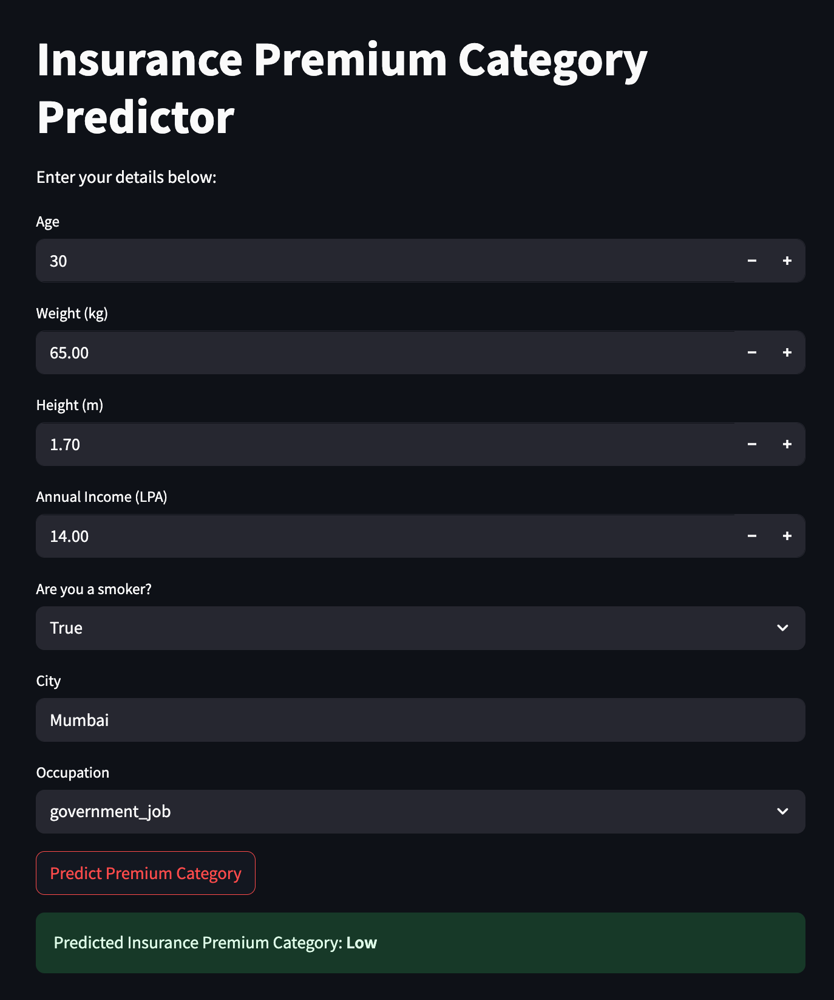

# 🏥 HealthGuard AI: Smart Patient Management & Insurance Predictor 🚀


# 🩺 AI-powered Patient Management & Insurance Premium Predictor 🚀

Welcome to the **Patient Management & Insurance Premium Prediction System** – a full-stack project that combines FastAPI, a trained ML model, and Streamlit to manage patient records and predict insurance premium categories based on user details.

---

## 💡 Features

- 🔧 **Patient Management API** (FastAPI)
  - Add, view, edit, delete patient records
  - Auto-calculated **BMI** and **health verdict**
  - Sort by height, weight, or BMI (asc/desc)
- 🤖 **Insurance Premium Predictor** (ML + FastAPI)
  - Predicts premium risk category based on age, BMI, lifestyle, city, income, and occupation
  - City tier and lifestyle risk are auto-computed
- 🖥️ **Frontend App** (Streamlit)
  - Clean, simple UI to interact with the predictor API
  - Real-time prediction results displayed to the user
- 💾 **Local JSON Database**
  - Patient records are stored in `patients.json` for persistence

---

## 📁 Project Structure

```

📦fastapi_for_ml/
├── basic_concepts_fastapi/
│    └── main.py                # Patient management API (FastAPI)
│    └── patients.json          # Data store for patient records
├── fastapi_with_ml_model/
│    └── app.py                 # ML prediction API (FastAPI)
│    └──  frontend.py           # Streamlit UI for prediction
│    └── insurance_data.csv     # Data to train the model
│    └── model_building.ipynb   # Building ML model
│    └── model.pkl              # Model binary
└── requirement.txt             # Python dependencies

```

---

## ⚙️ Installation & Setup

### 1. Clone the Repository

```bash
git clone https://github.com/your-username/patient-insurance-app.git
cd patient-insurance-app
```

### 2. Create and Activate Virtual Environment

```bash
python -m venv venv
source venv/bin/activate  # On Windows use `venv\Scripts\activate`
```

### 3. Install Requirements

```bash
pip install -r requirements.txt
```

---

## 🚀 Running the Project

### 1. Start the Patient Management API

```bash
uvicorn main:app --reload --port 8001
```

> Endpoints like `/`, `/view`, `/patient/{id}`, `/create`, `/edit/{id}`, and `/delete/{id}` available.

---

### 2. Start the Premium Prediction API

```bash
uvicorn app:app --reload --port 8000
```

> Endpoint: `POST /predict`

---

### 3. Launch the Frontend UI (Streamlit)

```bash
streamlit run frontend.py
```

> Make sure `app.py` is running at `http://localhost:8000` before launching the UI.

---

## 📊 Sample Patient Data (`patients.json`)

```json
{
  "P001": {
    "name": "Ananya Verma",
    "city": "Guwahati",
    "age": 28,
    "gender": "female",
    "height": 1.65,
    "weight": 90.0,
    "bmi": 33.06,
    "verdict": "Obese"
  },
  ...
}
```

---

## 🧠 How Prediction Works

The prediction model takes into account:

- BMI (auto-computed)
- Lifestyle risk (based on smoking and BMI)
- Age group (young, adult, middle_age, senior)
- City tier (1/2/3 based on predefined lists)
- Income (in LPA)
- Occupation

Returns: **Insurance Premium Category** (e.g., High, Medium, Low)

---

## 📦 Dependencies

```txt
fastapi
uvicorn
pydantic
pandas
scikit-learn
requests
streamlit
```

---

## 🤝 Contributing

Pull requests are welcome! For major changes, please open an issue first to discuss what you'd like to change.

---

## 📜 License

[MIT License](LICENSE)

---

## 🔥 Author

Made with ❤️ by [Praveen](https://github.com/praveenkumarsrivas)

---

## Special Thanks to [CampusX](https://www.youtube.com/@campusx-official) ❤️

## 📸 Screenshots



---

## 🚀 keep Learning